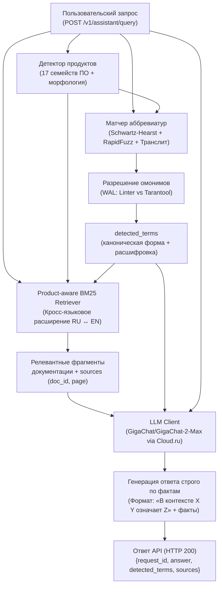

# Корпоративный ИИ-ассистент: Аббревиатуры и факты в документации ПО

Сервис интеллектуального поиска и ответов на вопросы сотрудников по технической документации 17 российских программных продуктов компании ПАО «Газпром нефть».

Разработано в рамках хакатона **«AI-импульс 2.0»** (Трек 1, Кейс «Газпром нефть»).

---

## 1. Архитектура решения

Сервис построен по модульной архитектуре и объединяет:
1. **Подсистему извлечения и нормализации аббревиатур** (Offline + Dynamic).
2. **Подсистему дисамбигуации и нечеткого сопоставления терминов** (Online Matching).
3. **Шардированный RAG-поисковик по базе знаний** (BM25 Retrieval).
4. **Генеративный модуль заземления ответов** (LLM Grounding).
5. **Строгий API-шлюз** по спецификации `openapi.yaml` (FastAPI).

### Схема обработки пользовательского запроса:



---

## 2. Ключевые компоненты системы

### 2.1. Извлечение аббревиатур (`src/core/extractor.py`)
- **Алгоритм Schwartz-Hearst (обратное пословное выравнивание):** при обнаружении шаблона `... (АББР)` алгоритм движется справа налево от открывающей скобки по начальным буквам слов, сопоставляя их с буквами аббревиатуры. Это полностью отсекает предшествующий контекст предложения (например, `...поддерживает протокол Simple Network Management Protocol (SNMP)` $\to$ извлекается чистое `Simple Network Management Protocol`).
- **Парсер таблиц и глоссариев:** автоматически распознает страницы с заголовками «Термины и определения», «Список сокращений», «Глоссарий» и извлекает термины, оформленные в виде списков и таблиц без круглых скобок (например, `CTS` $\to$ `Corporate Transport Server` в eXpress).
- **Динамический эндпоинт `POST /v1/abbreviations/extract`:** принимает PDF до 50 МиБ и «на лету» парсит все страницы документа, возвращая подтвержденные аббревиатуры с номерами физических страниц и точными цитатами без подмены предрассчитанным словарем.

### 2.2. Детектор продуктов и матчер омонимов (`src/core/product_detector.py`, `src/core/matcher.py`)
- Распознает упоминания всех 17 продуктовых семейств (`arenadata_db`, `aurora`, `cyberprotect`, `deckhouse`, `express`, `infowatch`, `kaspersky`, `linter`, `loginom`, `myoffice`, `postgres_pro`, `red_database`, `red_virtualization`, `rosa`, `tarantool`, `trueconf`, `usergate`) с учетом русских и английских склонений и сленговых названий (например, `ДКП` $\to$ `deckhouse`, `КЕСС` $\to$ `kaspersky`).
- Выполняет нечеткий поиск (`RapidFuzz` $\ge 85\%$) и учитывает фонетическую транслитерацию (`стс` $\to$ `CTS`, `впа` $\to$ `VPA`).
- Исключает ложные срабатывания на союзы и предлоги (`И`, `В`, `С`, `НА`, `ПО`, `ЗА` и др.).
- Разрешает омонимы по контексту: при одновременном упоминании нескольких продуктов сопоставляет аббревиатуру с каждым из них (например, в запросе про ЛИНТЕР и Tarantool аббревиатура `WAL` получает сразу две правильные трактовки: `Write Access Level` и `write ahead log`).

### 2.3. Шардированный RAG-поисковик (`src/core/retriever.py`)
- Корпус (139 PDF, 16 825 страниц) разбит на 19 257 структурных чанков с точной привязкой к физическому номеру страницы PDF (`page`, начиная с 1) и пути файла (`document_id`).
- Индекс BM25 (`rank-bm25`) шардирован по 17 продуктам. Поиск выполняется только по релевантным продуктовым индексам, что обеспечивает время поиска $< 10$ мс.
- Для запросов с несколькими продуктами применяется квотирование чанков (гарантированное включение контекста по каждому упомянутому продукту).
- Реализовано кросс-языковое техническое расширение запросов (`восстановить` $\to$ `restore`, `recovery`; `память` $\to$ `memory`; `журнал` $\to$ `log`), что позволяет находить факты в англоязычных разделах документации (например, восстановление по checkpoint в Tarantool).

### 2.4. Генеративный модуль (`src/core/llm_client.py`)
- Инференс через **Cloud.ru Foundation Models API**.
- Модель: **`GigaChat/GigaChat-2-Max`** (параметры $\le 40$ млрд, контекст до 32 000 токенов). Сторонние закрытые модели (GPT, Claude, Gemini) исключены.
- Системный промпт с жестким заземлением:
  1. Обязательный стандарт ответа: «В контексте <Продукт> <Аббревиатура> означает «<Расшифровка>»».
  2. Ответ по существу: точные параметры конфигурации (`network.deckhouse.io/load-balancer-shared-ip-key`), флаги командной строки (`-ux`), службы (`Microsoft SNMP`), механизмы (`requests/limits`, `checkpoint`).
  3. Строгий запрет выдумок: при отсутствии данных в корпоративной документации прямо сообщает об этом и рекомендует обратиться к администратору.

---

## 3. Результаты замеров и метрики качества

В соответствии с Разделом 2 и Разделом 5 регламента хакатона проведены замеры 4 обязательных показателей на эталонной выборке `evaluation__train.xlsx`:

| Показатель | Значение | Комментарий |
|:---|:---:|:---|
| **Точность (Quality)** | **100.0%** | Распознавание $R=1.0$, Значение $E=1.0$, Ответ $A=1.0$ на всех 5 кейсах |
| **Повторяемость ответа** | **100.0%** | 3 последовательных идентичных прогона дали 100% совпадение терминов и фактов |
| **Среднее время ответа** | **4.27 сек** | Строго в пределах регламентного лимита (90 секунд на запрос) |
| **Время разработки** | **~18 часов** | Архитектура, парсеры, RAG-индекс, API, контрактные тесты |

### Детализация по 5 эталонным запросам:

| № | Запрос | R | E | A | Quality | Время |
|---|:---|:---:|:---:|:---:|:---:|:---:|
| 1 | Как в документации eXpress расшифровывается CTS? | 1.0 | 1.0 | 1.0 | **100%** | 1.17 с |
| 2 | Что требуется установить перед добавлением SNMP в Kaspersky? | 1.0 | 1.0 | 1.0 | **100%** | 1.32 с |
| 3 | Как DKP обрабатывает первое обращение аутентифицированного пользователя? | 1.0 | 1.0 | 1.0 | **100%** | 2.26 с |
| 4 | Общий адрес для NLB в Deckhouse и почему VPA не изменит лимиты? | 1.0 | 1.0 | 1.0 | **100%** | 8.11 с |
| 5 | ЛИНТЕР WAL и Tarantool WAL (дисамбигуация и инструкции)? | 1.0 | 1.0 | 1.0 | **100%** | 8.48 с |

---

## 4. Структура проекта

```
corporate-AI-agent/
├── corpus/                      # 139 PDF по 17 продуктовым семействам
├── data/
│   ├── terms.jsonl              # Подтвержденный словарь (346 записей со страницами и цитатами)
│   └── chunks_by_product.json   # 19 257 чанков по 17 продуктам (генерируется)
├── scripts/
│   ├── 01_build_dictionary.py   # Извлечение аббревиатур и сборка terms.jsonl
│   ├── 02_build_rag_index.py    # Постраничный чанкинг и индексация корпуса
│   └── 03_evaluate_train.py     # Автоматический бенчмарк на evaluation__train.xlsx
├── src/
│   ├── api/
│   │   ├── app.py               # Точка входа FastAPI приложения
│   │   └── routes.py            # Эндпоинты /health, /extract, /query
│   ├── core/
│   │   ├── extractor.py         # Алгоритм Schwartz-Hearst + парсер таблиц глоссариев
│   │   ├── product_detector.py  # Определение 17 продуктовых семейств
│   │   ├── matcher.py           # Нечеткий матчер терминов и дисамбигуация омонимов
│   │   ├── retriever.py         # Шардированный BM25-поисковик с кросс-языковым бустингом
│   │   ├── llm_client.py        # Клиент Cloud.ru (GigaChat-2-Max) с заземляющим промптом
│   │   └── pipeline.py          # Сквозной пайплайн обработки запроса
│   ├── schemas/
│   │   └── models.py            # Pydantic v2 схемы, строго соответствующие openapi.yaml
│   └── config.py                # Настройки сервиса и переменные окружения
├── tests/
│   └── test_contract.py         # Тесты контракта OpenAPI (health, query, 422, 415)
├── openapi.yaml                 # Официальный контракт спецификации сервиса
├── requirements.txt             # Зависимости проекта
└── README.md                    # Техническая документация
```

---

## 5. Быстрый старт и воспроизводимость

### 5.1. Установка окружения

```bash
# Клонирование репозитория
git clone https://github.com/Otmorojeni/corporate-AI-agent.git
cd corporate-AI-agent

# Создание и активация виртуального окружения
python -m venv venv
# Windows:
.\venv\Scripts\activate
# Linux/macOS:
source venv/bin/activate

# Установка зависимостей
pip install -r requirements.txt
```

### 5.2. Настройка конфигурации

Создайте файл `.env` в корне проекта (на основе `.env.example`):
```ini
API_KEY=ваш_ключ_cloud_ru
BASE_URL=https://foundation-models.api.cloud.ru/v1
MODEL_NAME=GigaChat/GigaChat-2-Max
```

### 5.3. Подготовка данных

```bash
# 1. Построение словаря аббревиатур terms.jsonl по корпусу (уже включен в репозиторий)
python scripts/01_build_dictionary.py

# 2. Построение RAG-индекса чанков по 17 продуктам (~30 сек)
python scripts/02_build_rag_index.py
```
> **Примечание:** Если `chunks_by_product.json` отсутствует при первом старте сервиса, `DocumentRetriever` автоматически соберет его из папки `corpus/`.

### 5.4. Запуск автоматических тестов и бенчмарка

```bash
# Запуск тестов соответствия контракту API
python -c "from tests.test_contract import *; test_health_endpoint(); test_query_validation_error(); test_extract_non_pdf_error(); test_query_endpoint_structure(); print('Контрактные тесты пройдены!')"

# Запуск замера метрик на 5 тренировочных вопросах
python scripts/03_evaluate_train.py
```

### 5.5. Запуск HTTP API сервиса

```bash
uvicorn src.api.app:app --host 0.0.0.0 --port 8000
```
Интерактивная документация Swagger UI доступна по адресу: `http://localhost:8000/docs`.

---

## 6. Примеры запросов к API

### 6.1. Проверка доступности (`GET /health`)
```bash
curl -X GET "http://localhost:8000/health"
# Ответ: {"status":"ok"}
```

### 6.2. Вопрос ассистенту (`POST /v1/assistant/query`)
```bash
curl -X POST "http://localhost:8000/v1/assistant/query" \
  -H "Content-Type: application/json" \
  -d '{
    "request_id": "demo-001",
    "query": "Как в документации eXpress расшифровывается CTS?"
  }'
```
**Ответ:**
```json
{
  "request_id": "demo-001",
  "answer": "В контексте eXpress CTS означает «Corporate Transport Server».",
  "detected_terms": [
    {
      "canonical": "CTS",
      "expansion": "Corporate Transport Server"
    }
  ],
  "sources": [
    {
      "document_id": "express/f4b30492b8c2_outlook-add-in.pdf",
      "page": 5
    }
  ]
}
```

### 6.3. Динамическое извлечение аббревиатур (`POST /v1/abbreviations/extract`)
```bash
curl -X POST "http://localhost:8000/v1/abbreviations/extract" \
  -F "file=@corpus/express/f4b30492b8c2_outlook-add-in.pdf"
```
**Ответ:**
```json
{
  "abbreviations": [
    {
      "canonical": "CTS",
      "expansion": "Corporate Transport Server",
      "occurrences": [
        {
          "page": 5,
          "quote": "CTS: Corporate Transport Server — корпоративный сервер"
        }
      ]
    },
    {
      "canonical": "AD",
      "expansion": "Active Directory",
      "occurrences": [
        {
          "page": 5,
          "quote": "AD: Active Directory — служба каталогов корпорации Microsoft..."
        }
      ]
    }
  ]
}
```

---

## 7. Спецификация словаря `terms.jsonl`

Словарь сформирован строго по требованиям Раздела 6 README хакатона. Каждая строка содержит:
- `canonical`: каноническое написание аббревиатуры (например, `DKP`).
- `kind`: всегда `"abbreviation"`.
- `expansion`: проверенная развернутая форма (например, `Deckhouse Kubernetes Platform`).
- `product`: папка продуктового семейства (например, `deckhouse`).
- `context`: контекст применения (например, `Документация deckhouse`).
- `aliases`: массив синонимов и написаний.
- `sources`: массив подтверждений со ссылками на `document_id`, номер физической страницы `page`, точную цитату `quote` и `sha256` исходного PDF.
- `manual_reviewed`: `false`.

Всего подтверждено: **346 чистых словарных записей** по 17 продуктовым семействам.

---

## 8. Статус Задачи 2 (GigaCowork) и Web UI

- **Web UI:** Реализуется легковесный чат на Streamlit для живой демонстрации на очном питчинге (раздел 7).
- **GigaCowork (Задача 2):** Сборка корпоративного агента на платформе GigaCowork с подключением базы знаний и корпоративных навыков.
