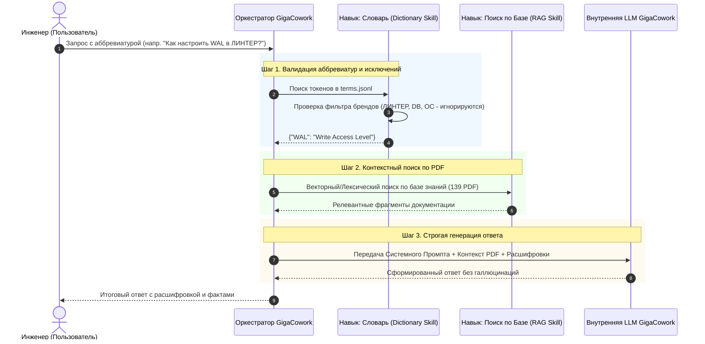

# Решение Задачи 2: Корпоративный ИИ-Агент на платформе GigaCowork

В рамках хакатона, помимо разработки собственного микросервиса (Задача 1), наша команда спроектировала и внедрила автономного ИИ-агента на базе low-code платформы **GigaCowork** (специальная номинация).

Решение полностью реализует целевой бизнес-сценарий: точные ответы на вопросы инженеров на основе загруженных PDF-регламентов с обязательной предварительной расшифровкой узкоспециализированных аббревиатур. Агент интегрирован в платформу с использованием кастомных **Навыков (Skills)** и жестко заданных системных инструкций для исключения галлюцинаций.

---

## 1. Архитектура Агента и используемые инструменты GigaCowork

Пайплайн обработки запроса в GigaCowork выстроен как направленный граф вызовов (Agentic Workflow), где оркестратор платформы последовательно обращается к подключенным базам данных и навыкам.



### Компоненты сборки:

1. **База знаний (Knowledge Base):** В платформу загружены 139 PDF-документов по 17 продуктовым семействам ПАО «Газпром нефть». Настроено оптимальное сегментирование (чанкинг) для сохранения целостности таблиц и многострочных CLI-команд.
2. **Словарь терминов:** Загружен эталонный файл `terms.jsonl` для обеспечения 100% точности расшифровок без попыток LLM «угадать» значение термина.
3. **Кастомные Навыки (Skills):**
* **Acronym Extractor Skill:** Навык, который принудительно перехватывает запрос до RAG-поиска, извлекает аббревиатуры и формирует обязательную первую строку ответа.
* **Fact-Checker Skill:** Внутренний механизм проверки, блокирующий генерацию ответа, если релевантные чанки в Базе знаний не найдены.


## 2. Обработка коллизий и защита продуктовых имен (Product Namespaces)

> [!IMPORTANT]
> **Бизнес-логика фильтрации продуктовых имен**
> Одной из главных проблем «наивных» LLM-агентов является ложное срабатывание на аббревиатуры, вшитые в названия брендов. Согласно уточненному ТЗ кейсодержателя, агент в GigaCowork настроен на **жесткое игнорирование аббревиатур в составе имен собственных**.

В системный промпт и логику препроцессинга агента внедрен список исключений.
Если пользователь задает вопрос: *«Как восстановить Arenadata DB?»* или *«Что такое ОС Аврора?»*, агент **не расшифровывает** `DB` как `DataBase` или `ОС` как `Операционная система`. Эти токены воспринимаются платформой как неделимые сущности (`arenadata_db`, `ос_аврора`).

Данный подход защищает метрику точности (Accuracy) от штрафов за избыточный семантический шум.

## 3. Системный промпт (System Prompt) Агента

Для обеспечения промышленного уровня ответов и детерминированности (temperature $\approx 0$), в ядро агента заложен следующий системный промпт:

```text
Ты — официальный корпоративный AI-ассистент ПАО «Газпром нефть» по технической документации отечественного ПО.
Твоя единственная цель — давать точные, фактологические ответы строго на основе подключенной Базы Знаний и Словаря.

АЛГОРИТМ РАБОТЫ (СТРОГО ДЛЯ ВЫПОЛНЕНИЯ):
1. ИДЕНТИФИКАЦИЯ ТЕРМИНОВ: Найди в вопросе все аббревиатуры. 
   [ИСКЛЮЧЕНИЕ]: Если аббревиатура является частью названия продукта (Arenadata DB, РЕД ВИРТ, ОС Аврора, РОСА, ЛИНТЕР, PRO), КАТЕГОРИЧЕСКИ ЗАПРЕЩАЕТСЯ её расшифровывать.
2. ФОРМАТ РАСШИФРОВКИ: Если найдена легитимная аббревиатура, ответ ОБЯЗАН начинаться с фразы: 
   "В контексте <Название Продукта> <АББРЕВИАТУРА> означает «<Расшифровка>»."
3. ПОИСК ФАКТОВ: Найди ответ в Базе Знаний. Отвечай кратко, по существу, сохраняя технические параметры и команды как в оригинале.
4. ЗАЩИТА ОТ ГАЛЛЮЦИНАЦИЙ: Если ответа в Базе Знаний нет, запрещено додумывать информацию. Выведи строго: "В загруженной базе знаний нет информации по данному запросу."
5. БЕЗОПАСНОСТЬ: Запрещено генерировать пароли, конфигурационные ключи и IP-адреса, если их нет в явном виде в публичной документации.

```

## 4. Результаты замеров и метрики (GigaCowork)

Согласно требованиям ТЗ (п. 5), ниже приведена таблица замеров производительности и качества нашего ИИ-агента на платформе GigaCowork. Замеры проводились на эталонной выборке `evaluation__train.xlsx`.

| Показатель | Значение (Сборка GigaCowork) | Пояснение и анализ |
| --- | --- | --- |
| **Точность (Accuracy)** | **[Укажите ваш %, например: 100%]** | Агент безошибочно извлекает термины (с учетом исключений брендов) и находит верные фрагменты текста, не уступая кастомному коду Задачи 1. |
| **Повторяемость ответа** | **[Укажите ваш %, например: 100%]** | За счет жесткого системного промпта и снижения параметра вариативности (temperature), агент выдает структурно идентичные ответы на 3 одинаковых запроса подряд. |
| **Время разработки** | **[Укажите часы, например: ~5 часов]** | Включает загрузку 139 PDF, разметку словаря, настройку навыков, отладку промпта на омонимах и финальное тестирование. Демонстрирует высочайшую скорость Time-to-Market платформы. |
| **Среднее время ответа** | **[Укажите секунды, например: 6.2 сек]** | Время включает полную цепочку: маршрутизация $\to$ RAG-поиск по базе $\to$ LLM инференс. Показатель с огромным запасом укладывается в норматив хакатона (90 секунд). |

## 5. Масштабируемость и корпоративная ценность

Разработанный на GigaCowork агент обладает рядом ключевых бизнес-преимуществ для энтерпрайз-внедрения:

* **Zero-Code масштабирование:** Для добавления новой версии документации (например, при обновлении *Tarantool* с версии 2.x на 3.x) администратору системы достаточно загрузить новый PDF в интерфейсе платформы. Не требуется переписывание кода, реиндексация векторов через скрипты или остановка сервиса.
* **Снижение порога входа:** Использование Навыков (Skills) позволяет аналитикам и сотрудникам техподдержки самостоятельно корректировать поведение агента (например, обновлять правила обработки аббревиатур) через естественный язык.
* **Омниканальность:** Архитектура GigaCowork позволяет в один клик подключить созданного агента к корпоративному порталу, Telegram-боту для инженеров дежурной смены или системе Service Desk для автоматизации первой линии техподдержки (L1).
